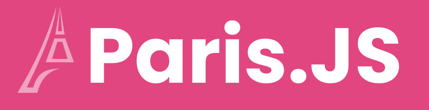
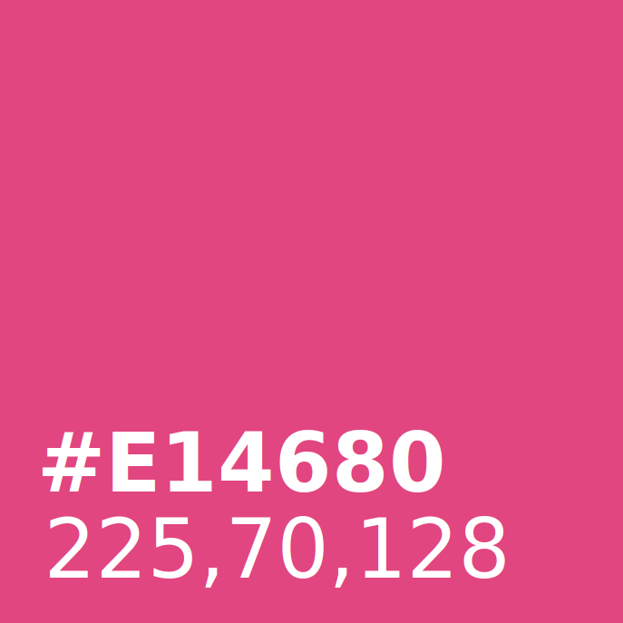
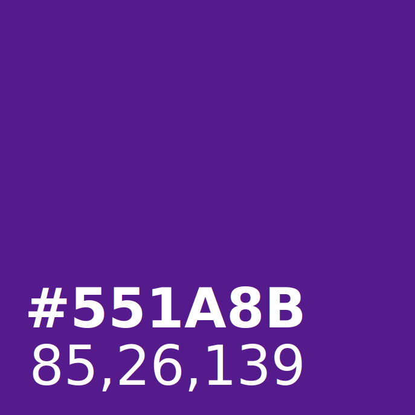
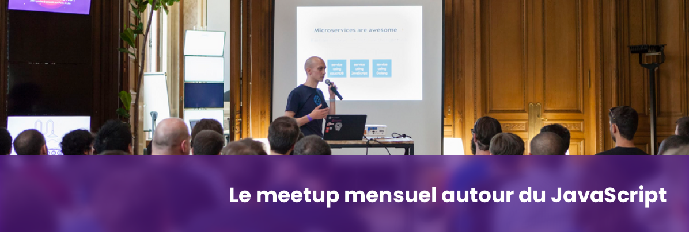

# Paris.JS Branding

## Logo

## Logo large

## Favicon

## Accent colors

## Social header

## Contents

- Logo
- Favicon
- Fonts (Poppins & Hack)
- Social assets

## License

The default licence for the stuff in this repository are CC-BY-SA, unless specified otherwise.
